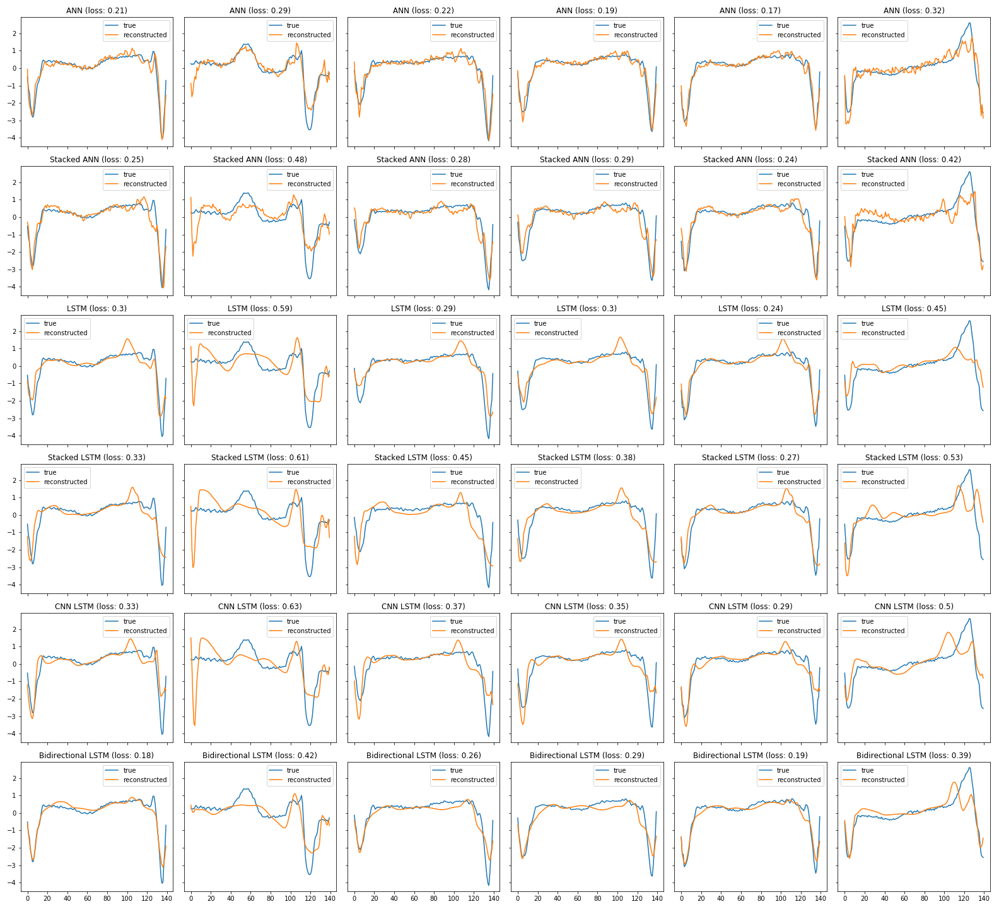
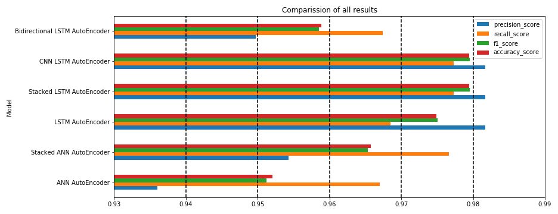

# Anomaly Detection in ECG

## Overview
The goal of this project is to compare the performance of several AutoEncoders in detecting ECG anomalies.

## Models
The following AutoEncoder architectures have been tested:
- ANN AutoEncoder with single dense layer
- ANN AutoEncoder with double dense layers
- LSTM AutoEncoder with single reccurent layer
- Stacked LSTM AutoEncoder with double reccurent layers
- CNN-LSTM AutoEncoder with convolution layer to encode feature
- Birectional-LSTM AutoEncoder with birectional-lstm layer in encoder and decoder

## Data
Data come from [http://timeseriesclassification.com/description.php?Dataset=ECG5000](http://timeseriesclassification.com/description.php?Dataset=ECG5000)

## Dependencies
* Python 3.7
* Pandas
* Numpy
* Matplotlib
* Scikit-learn
* Seaborn
* Arff2pandas
* TensorFlow 2.0 GPU Version

## Scope of work
* 1 Data preparation
* 2 Modeling
* 3 Final comparison and conclusions

## Reconstructed anomaly ECG sequenced (the higher the loss, the better)

## Final prediction metrics

